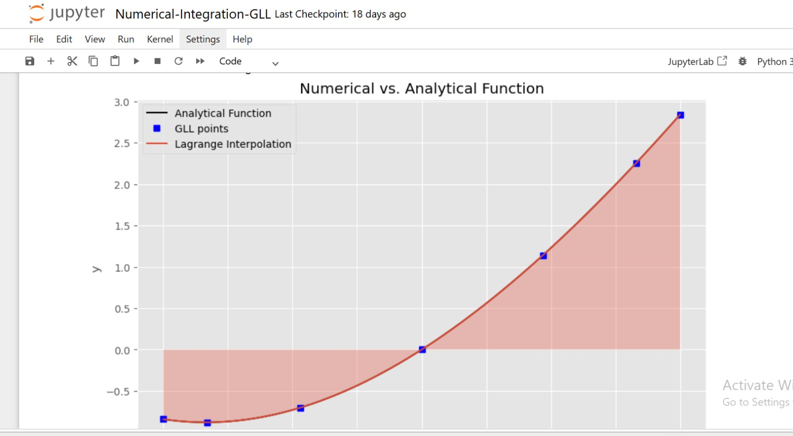

# Numerical Integration with Gauss-Lobatto-Legendre (GLL) Quadrature

A numerical methods project implementing GLL quadrature and Lagrange interpolation to
approximate definite integrals, and comparing the result against the analytical solution.

## Overview

Gauss-Lobatto-Legendre (GLL) quadrature is a numerical integration scheme widely used in
spectral element methods for solving PDEs. Unlike standard Gauss-Legendre quadrature, GLL
points include the interval endpoints, which makes them especially useful for enforcing
boundary conditions and coupling elements in spectral element discretizations.

This project:

- Computes GLL collocation points and integration weights for a chosen polynomial order `N`
- Evaluates a test function `f(x) = x + x^2 + sin(x)` at those points
- Numerically integrates `f(x)` over `[-1, 1]` using GLL quadrature
- Builds a Lagrange interpolant through the GLL points
- Compares the numerical result against the known analytical integral
- Visualizes the function, the GLL points, and the interpolant

## Project Structure

```
.
├── Numerical-Integration-GLL.ipynb   # Main notebook
├── gll.py                            # GLL points and weights (N = 2 to 12)
├── lagrange2.py                      # Lagrange interpolating polynomial
├── images/
│   └── result_plot.png               # Sample output
├── requirements.txt
└── README.md
```

## Getting Started

### Prerequisites

- Python 3.8+

### Installation

```bash
git clone https://github.com/YOUR_USERNAME/YOUR_REPO_NAME.git
cd YOUR_REPO_NAME
pip install -r requirements.txt
```

### Usage

Launch the notebook:

```bash
jupyter notebook Numerical-Integration-GLL.ipynb
```

Run all cells to reproduce the result above. To experiment:

- Change `f` and `intf` in the second cell to test a different function and its known
  analytical integral
- Change `N` to see how the accuracy of the quadrature changes with polynomial order

## Sample Result

For `N = 6`, the quadrature closely matches the analytical integral:

| | Value |
|---|---|
| Analytical integral | 0.666667 |
| Numerical integral (GLL, N=6) | 0.666668 |

## Background

This project applies concepts from numerical methods for PDEs, including finite difference
operators, spectral/finite element methods, and Gauss-Lobatto-Legendre quadrature.

## Author

**Tabassum Tariq**
BS Computational Physics, Centre for High Energy Physics (CHEP)
University of the Punjab, Lahore, Pakistan
[LinkedIn](https://linkedin.com/in/tabassum-tariq-a0415b36a)

## License

This project is open source and available for educational use.
